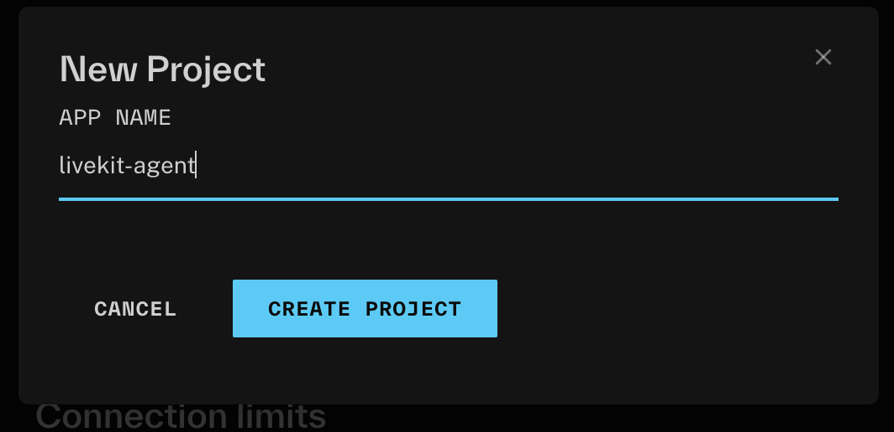

This is a example project for livekit-agents. Try it here: https://livekit-agent-nu.vercel.app/

It can do the following:
- [ ] Talk to the agent
- [ ] Ask the agent about the weather
- [ ] Ask the agent about a document (The agent will read the document on the server and RAG it)

It uses two parts:
- Client: This is a startard nextapp
- Server: A cloud-run server that run a livekit-agent

## What you need to run this project

- Start the local livekit agent via: `node --import=tsx agent/agent.ts dev`

## create a token for a user
lk token create \    
  --api-key <api-key> --api-secret <api-secret> \
  --join --room test_room --identity test_user \
  --valid-for 24h

### Livekit Cloud
1) Create a project

2) Head to Settings and create an API key and secret.
Store the output in the .env file under `LIVEKIT_API_KEY` and `LIVEKIT_API_SECRET` and `LIVEKIT_URL`

3) Run the agent with `node --import=tsx agent/agent.ts dev`

4) Start the client with `npm run dev`

5) Open the client in the browser and start talking to the agent. Usually the server runs on http://localhost:3000

